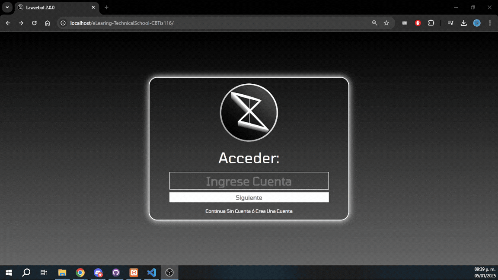

# eLearning Platform

### Contexto
Las plataformas de e learning o lms, son bastante populares, el proyecto final de la carrera técnica era definir uno, y implementarlo. En su momento no existián plataformas para aprender y practica la lectura de notas de solfeo, entonces se diseño esta plataforma. Que enseña a los usuarios a leer partituras.

### Tecnologías
La base de datos se encuentra en **MySQL**.

La lógica de la vista se encuentra entre Js y PHP, estaba en mis fases iniciales de desarrollo y la lógica no esta en su mejor estado, así que en ambos lenguajes se encuentra mixta la lógica.

### Instalación 

1. Clona el repositorio: 
    
    **Importante: Esto se debe de realizar desde la carpeta de xampp de htdocs!!!**

    ```bash
    git clone https://github.com/AntonioNoguera/eLearing-TechnicalSchool-CBTis116.git
    cd eLearing-TechnicalSchool-CBTis116

2. Configura MySQL

    Asegúrate de tener MySQL instalado y configurado correctamente. Puedes instalarlo usando herramientas como XAMPP si no lo tienes aún.
    
    Se requiere de instalar la base de datos de forma manual, con el archivo de **elearningphp** se ocupa de importar la base de datos.

3. Ejecucción

    En este caso levantar la plataforma no es tan complejo, se ocupa de correr MySQL y apache, para poder utilizar el htdocs, y abrir directamente el localhost.

## Funcionalidad

### Registro  
En este proyecto, crear cuentas no es algo muy complejo, pues el proyecto no cuenta con algun tipo de control de contenidos, o usuarios, todos las peticiones son aprobadas automáticamente, lo que hace que el algunos campos del login puedan ser descartables.


#### Validación
Claro que se cuenta con la validación de formularios, para evitar que, el usuario ingrese datos al azar, se introdujo una ligera validación de los campos. Que los campos sean del tipo requerido, que las contraseñas coincidan, etc.


### Inicio de sesión
Algo que siempre me había molestado de muchas interfaces era que no me enteraba de cuando el usuario había logrado o no iniciar sesión, o que el proceso no era tan claro, este flujo buscaba dejar demasiado en claro al usuario cuando había logrado o no iniciar sesión.


### Sesión de invitado
Claro que la plataforma no obliga a los usuarios a entrar para poder interactuar, unicamente para poder visualizar los post realizados por otros usuarios.

 
 ### Crea un post
 Una de las funcionalidades no críticas pero relevante, es la habilidad de generar post para los demás usuarios. Esta es sencilla, límite de caracteres únicamente, y como detalle interesante al estar almacenado en php, procesa HTML.


### Gestión de Sesiones
El usuario cuenta con una sesión, por lo que se permite que el usuario pueda revisitar su cuenta de forma rápida, sin tener que volver a hacer inicio de sesión, me encantaría decir que esto se consigue con algún token, localStorage, o cookie, sin embargo por la época no conocia nada de esto, así que guardo las ip en la base de datos....


### Curso en la plataforma
El principal objetivo de este proyecto es enseñar a los usuarios para aprender toda la teória básica del solfeo, entonces la idea es principalmente navegar a travez de este en forma de unidades, una vez cursando el contenido de la unidad


### Actividades del curso
Como no quería que el curso fuera unicamente examen, desarrolle como un quiz mas interactivo en el que se tiene que tener cierto dominio, y se debe de obtener una calificación por arriba del 80% para poder obtener el curso como completado.


### Mejoras
- Seguridad: En su tiempo se me hizo sencillo guardar en la tabla las ip que hacian login con el único fin de guardar el ultimo dispositivo que tuvo la sesión de esa cuenta, no estoy seguro de si esto se haya llegado a realizar alguna vez, pero hoy en día es muy mala practica.

- Base de Datos: El formato de la base de datos, se hizo a como dios me dio a entender, y la estructura es objectivamente mala, mejorarala sería un buen fix.

- Usuarios Repetidos: No recuerdo, pero si tuvier que adivinar, diría que no valido los usuarios, por lo que podrían existir incidencias en los usuarios, donde se repita el nombre del perfil.

## Contribución
¡Las contribuciones son bienvenidas! 

1. Haz un fork del repositorio.  
2. Crea una nueva rama (`git checkout -b feature/nueva-funcionalidad`).  
3. Haz commit de tus cambios.  
4. Haz un push a la rama (`git push origin feature/nueva-funcionalidad`).  
5. Abre un Pull Request.

### Autor(es)

- **Michael Noguera** - [Github](https://github.com/AntonioNoguera)